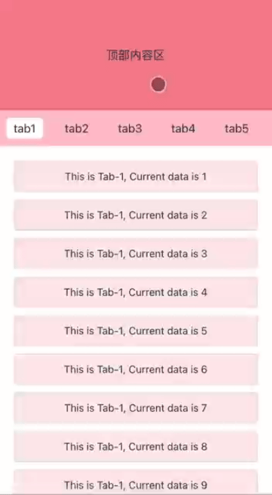

# Vue3-multi-tab-swiper

### 介绍

`MultiTabSwiper` 是一个用于 Vue 3 的多功能组件，它提供了丰富的交互特性，包括上拉加载更多数据、下拉刷新列表、顶部标签栏吸顶，以及水平滑动切换标签时的位置记忆功能。实现参考：[匠心打造多tab自动吸顶下的多滚动容器](https://zhuanlan.zhihu.com/p/410913113)

### 安装

```
npm i vue3-multi-tab-swiper
```

### 导入

```
import { createApp } from "vue";
import App from "./App.vue";

import MultiTabSwiper from "vue3-multi-tab-swiper";
import "vue3-multi-tab-swiper/lib/style.css";

let app = createApp(App);
app.use(MultiTabSwiper);
app.mount("#app");
```

### 使用示例

##### 上拉加载


##### 下拉刷新



##### 水平滑动位置记忆


##### 代码

```
<template>
  <multi-tab-swiper
    :tabs="tabs"
    :loadingEnd="isLoadingEnd"
    :hasMore="hasMoreData"
    @pulldownRefresh="pulldownRefresh"
    @pullupLoadMore="pullupLoadMore"
    @activeChange="activeChange"
  >
    <template #banner-content>
      <div class="banner-box">顶部内容区</div>
    </template>

    <template #refresh-indicator="{ state }">
      <div v-if="state === 'pulling'" class="refresh-text">下拉刷新...</div>
      <div v-if="state === 'releasing'" class="refresh-text">释放刷新...</div>
      <div v-if="state === 'refreshing'" class="refresh-text">正在刷新...</div>
      <div v-if="state === 'refreshed'" class="refresh-text">刷新完成！</div>
    </template>

    <template #load-more-indicator="{ state }">
      <div v-if="state === 'loadMore'" class="load-text">加载更多...</div>
      <div v-if="state === 'loading'" class="load-text">加载中...</div>
      <div v-if="state === 'noMoreData'" class="load-text">暂无更多数据...</div>
    </template>

    <div class="tab-content">
      <div class="data-item" v-for="(item, index) in data1" :key="index">
        This is Tab-{{ tabIndex + 1 }}, Current data is {{ index + 1 }}
      </div>
    </div>
    <div class="tab-content">
      <div class="data-item" v-for="(item, index) in data2" :key="index">
        This is Tab-{{ tabIndex + 1 }}, Current data is {{ index + 1 }}
      </div>
    </div>
    <div class="tab-content">
      <div class="data-item" v-for="(item, index) in data3" :key="index">
        This is Tab-{{ tabIndex + 1 }}, Current data is {{ index + 1 }}
      </div>
    </div>
    <div class="tab-content">
      <div class="data-item" v-for="(item, index) in data4" :key="index">
        This is Tab-{{ tabIndex + 1 }}, Current data is {{ index + 1 }}
      </div>
    </div>
    <div class="tab-content">
      <div class="data-item" v-for="(item, index) in data5" :key="index">
        This is Tab-{{ tabIndex + 1 }}, Current data is {{ index + 1 }}
      </div>
    </div>
    <div class="tab-content">
      <div class="data-item" v-for="(item, index) in data6" :key="index">
        This is Tab-{{ tabIndex + 1 }}, Current data is {{ index + 1 }}
      </div>
    </div>
  </multi-tab-swiper>
</template>

<script setup>
import { ref } from "vue";

let tabIndex = 0;
const tabs = ref(["tab1", "tab2", "tab3", "tab4", "tab5", "tab6"]);

const data1 = ref(new Array(20).fill(0));
const data2 = ref(new Array(20).fill(0));
const data3 = ref(new Array(20).fill(0));
const data4 = ref(new Array(20).fill(0));
const data5 = ref(new Array(20).fill(0));
const data6 = ref(new Array(20).fill(0));

let isLoadingEnd = ref(false);
let hasMoreData = ref(true);

const pulldownRefresh = () => {
  isLoadingEnd.value = false;
  setTimeout(() => {
    console.log("下拉刷新数据");
    let data = ref(getCurrentTabData(tabIndex));
    data.value = new Array(20).fill(0);
    isLoadingEnd.value = true;
  }, 1000);
};

const pullupLoadMore = () => {
  isLoadingEnd.value = false;
  hasMoreData.value = true;
  setTimeout(() => {
    console.log("上拉加载数据");
    let newData = new Array(10).fill(0);
    let data = ref(getCurrentTabData(tabIndex));

    data.value = data.value.concat(newData);
    isLoadingEnd.value = true;
    hasMoreData.value = data.value.length < 40;
  }, 1000);
};

const getCurrentTabData = (index) => {
  switch (index) {
    case 0:
      return data1;
    case 1:
      return data2;
    case 2:
      return data3;
    case 3:
      return data4;
    case 4:
      return data5;
    case 5:
      return data6;
    default:
      return data1;
  }
};

const activeChange = (index) => {
  tabIndex = index;
};
</script>

<style scoped lang="less">
.banner-box {
  height: 150px;
  display: flex;
  align-items: center;
  justify-content: center;
  background: #f58391;
}

:deep(.tabs) {
  background: pink;

  .tab-item.active {
    background: #fff !important;
  }
}
.tab-content {
  padding: 20px;

  .data-item {
    display: flex;
    justify-content: center;
    height: 40px;
    line-height: 40px;
    border: 1px solid #ddd;
    margin-bottom: 10px;
    font-size: 14px;
    border-radius: 4px;
    background: #ffe9ed;

    &:last-child {
      margin-bottom: 0;
    }
  }
}
.main-content {
  background: #fde7ea;
}

.refresh-text,
.load-text {
  margin-bottom: 10px;
}
</style>

```

### API参考

##### props

| 名称       | 类型    | 是否必须 | 描述                 |
| ---------- | ------- | -------- | -------------------- |
| tabs       | Array   | 是       | tabbar 上显示的标签  |
| loadingEnd | Boolean | 是       | 请求完成之后通知组件 |
| hasMore    | Boolean | 是       | 列表是否还有数据     |

##### Slots

| 名称                | 描述                                                         |
| ------------------- | ------------------------------------------------------------ |
| -                   | 默认插槽，用于渲染每个 tab项的内容。这里的第一层级 dom 数要和 tabs 数组项数对齐。 |
| banner-content      | 顶部内容区插槽                                               |
| refresh-indicator   | 下拉刷新插槽，是一个作用域插槽。抛出来的 state 的值：'pulling' \|\| 'releasing' \|\| 'refreshing' \|\| 'refreshed' |
| load-more-indicator | 上拉加载插槽，是一个作用域插槽。抛出来的 state 的值：'loadMore' \|\| 'loading' \|\| 'noMoreData' |

##### Events

| 名称            | 参数  | 描述                                         |
| --------------- | ----- | -------------------------------------------- |
| pulldownRefresh | -     | 当用户执行下拉刷新操作时触发。               |
| pullupLoadMore  | -     | 当用户滚动到底部并且启用上拉加载更多时触发。 |
| activeChange    | index | 当用户点击 tab 或者横滑结束后触发。          |

### 目前还存在的问题

左右滑动时，两侧出现的弹动问题。包括 tab 贴顶后，上滑 tab 出现的弹动问题。
